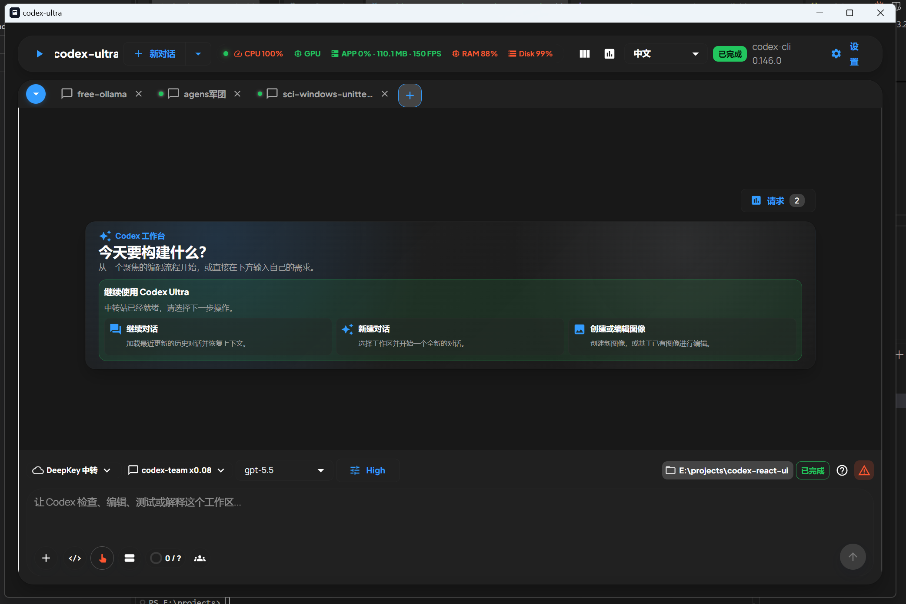
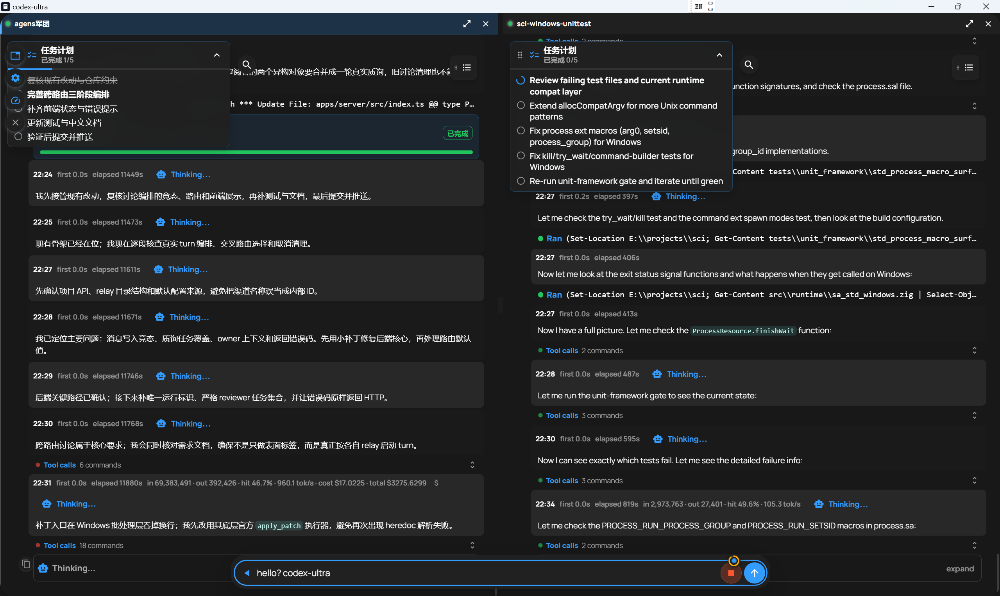
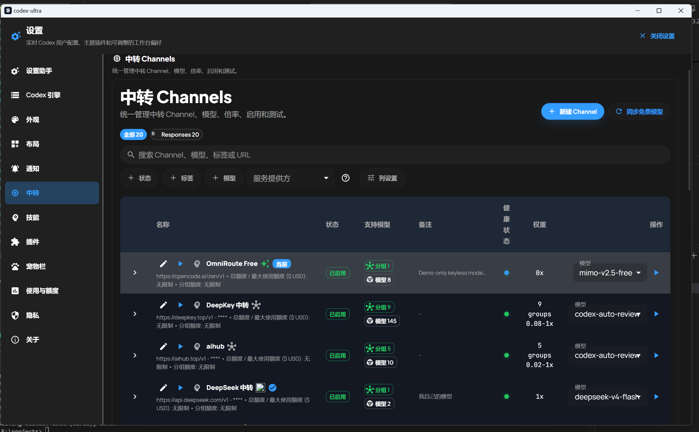

# codex-ultra

<p align="center">
  
</p>

<p align="center"><strong>面向 Codex CLI 的本地优先 AI 编程工作台</strong></p>

<p align="center">
  <a href="https://codex-ultra.top/">官方网站</a> ·
  <a href="https://github.com/layola13/codex-ultra/releases">下载发布包</a> ·
  <a href="https://github.com/layola13/codex-ultra/issues">提交 Issue</a> ·
  <a href="https://www.npmjs.com/package/@codex-ultra/cxu">npm 包</a> ·
  <a href="./README.md">English</a>
</p>


[](https://www.npmjs.com/package/@codex-ultra/cxu)

codex-ultra 将 Codex CLI 的终端能力放进一个可视化工作台：在同一窗口中管理对话、工作区、任务计划、工具调用、文件差异、模型渠道和插件。它优先在本机运行，网络请求只会发送到你主动配置的第三方模型服务。

## 关于项目

codex-ultra 是一套面向 Codex CLI 的本地优先 AI 编程工作台。它理解你的代码库，通过自然语言命令处理日常任务、解释复杂代码、审查变更、协调多步骤工作并管理 Git 工作流，让你在可视化桌面工作台中更快完成开发。

了解更多：[codex-ultra.top](https://codex-ultra.top/)。

> **仓库定位**：这是 codex-ultra 的产品说明、问题反馈和二进制发布仓库。此仓库**不提供源码下载、源码压缩包或源码构建流程**；请从 [Releases](https://github.com/layola13/codex-ultra/releases) 下载 Windows 安装版或便携版。

> GitHub 会为每个 Release 标签自动生成名为 `Source code (zip)` / `Source code (tar.gz)` 的仓库快照。它们只包含本仓库的说明文档、Issue 配置和展示图片，**不包含 codex-ultra 产品源码，也不是可安装程序**。

## 快速入口

| 需求 | 入口 |
| --- | --- |
| 了解产品与使用边界 | [官方网站](https://codex-ultra.top/) |
| 极速开始使用 | [开始使用](#开始使用) |
| 一键部署到 Vercel | [Vercel 部署](#1-官网一键部署到-vercel-免费全球-cdn) |
| 下载最新版桌面包 | [GitHub Releases](https://github.com/layola13/codex-ultra/releases)（选择列表最上方版本） |
| 查看版本变更 | [全部 Releases](https://github.com/layola13/codex-ultra/releases) |
| 报告崩溃、安装或运行问题 | [提交 Issue](https://github.com/layola13/codex-ultra/issues/new/choose) |
| 通过 npm 安装 cxu 命令行 | [cxu 命令行](#cxu-命令行-npm) |
| 查看隐私、条款与授权 | [法律与许可](#法律与许可) |

## 开始使用

> 🔒 **安全与源码隔离原则**：本仓库为官方说明与分发仓库。所有云端容器方案均通过官方 `install.sh` 安装纯预编译二进制运行包，运行在独立容器沙箱内，绝不包含、读取或上传任何未编译的 TypeScript 核心源码。

### 方式一：云端容器一键免费托管（免本机构建，白嫖公网云服务）

通过各大云平台免费 Docker 实例，自动拉取安装脚本并在公网常驻运行工作台服务（监听 43110 端口）：

#### 方案 A：Render 一键部署（推荐）
点击下方按钮一键部署到 Render 免费 Web Service：  
[](https://render.com/deploy?repo=https://github.com/layola13/codex-ultra)  
*Render 会自动识别本仓库的 `render.yaml` 蓝图，基于纯净 Debian 容器一键执行安装并常驻运行。*

#### 方案 B：Hugging Face Spaces 免费部署（永久 2核 16G 内存）
点击下方按钮在 Hugging Face 创建免费专属 Docker Space：  
[](https://huggingface.co/new-space?template=layola13/codex-ultra)  
*空间类型选择 Docker，HF 自动分配永久免费的独立容器和 HTTPS 公网域名。*

#### 方案 C：GitHub Codespaces 云端即开即用
点击下方按钮一键创建 GitHub Codespace 云端开发环境：  
[](https://codespaces.new/layola13/codex-ultra)  
*进入 Codespace 终端后运行 `bash launch.sh` 即可启动服务并自动转发 43110 端口打开浏览器工作台。*

---

### 方式二：官网展示页一键部署到 Vercel (免费全球 CDN)

点击下方按钮一键部署官方展示单页到 Vercel：  
[](https://vercel.com/new/clone?repository-url=https%3A%2F%2Fgithub.com%2Flayola13%2Fcodex-ultra&project-name=codex-ultra&repository-name=codex-ultra)  
*零依赖静态网页，由 Vercel 全球 Anycast CDN 极速分发。*

---

### 方式三：本地客户端一键安装启动 (推荐本地日常使用)

无需手动配置 Node.js、npm 或 Bun 环境，直接在终端中复制运行对应系统的命令即可自动安装：

**Windows (PowerShell):**
```powershell
irm https://install.codex-ultra.top | iex
```

**Linux / macOS (Terminal):**
```bash
curl -fsSL https://install.codex-ultra.top | bash
```

安装完成后，在任意终端输入 `cxu` 即可启动可视化工作台。

## 界面预览

### 工作台与新对话



三栏工作台支持历史会话、实时对话、任务计划、文件和工具审计。新对话可以直接选择工作区、模型、思考强度和权限预设。

### 多智能体与长任务



任务计划会显示进行中和已完成的步骤；Sidechat 为辅助线程提供独立上下文，适合并行检查测试、文档或不同工作区。

### 模型渠道与转发配置



在设置中管理 Responses、Chat Completions、Ollama、LM Studio 等兼容渠道，按模型维护别名、倍率、分组和启用状态。API Key 不写入项目仓库或 `config.toml`。

## 主要能力

- **Codex 工作台**：React + MUI 三栏布局，支持会话历史、流式消息、Markdown、代码差异和长会话虚拟列表。
- **任务与协作**：Plan/Goal 控制、任务清单、Sidechat 隔离标签页，以及多智能体工作流的状态展示。
- **真实 CLI 桥接**：通过本地 Bun HTTP/WebSocket bridge 对接 `codex app-server`，Web 工作台与 Codex TUI 可共享会话历史。
- **模型渠道**：保存和测试多个第三方 API 渠道，选择活动模型，配置模型别名、倍率、分组和访问白名单。
- **附件与工作区**：支持图片、PDF、Office 和文本附件；工作区可使用本地文件夹或 SSH 远程目录。
- **插件与主题**：管理 Codex 插件、MCP、Hooks、启动适配器和可导入导出的主题背景。
- **本地优先**：配置、会话、审计记录和偏好默认保存在本机；桌面端默认绑定回环地址。
- **安全与诊断**：权限预设、危险操作审计、登录保护、TOTP、运行状态和 WebSocket 诊断。

## 下载与安装

### 1. 下载桌面包

打开 [Releases](https://github.com/layola13/codex-ultra/releases)，在列表最上方版本的 **Assets** 中选择：

| 文件 | 适用场景 |
| --- | --- |
| `codex-ultra-setup.exe` | Windows 安装版，创建开始菜单和桌面快捷方式 |
| `codex-ultra.exe` | Windows x64 便携版，解压或直接运行，不修改系统安装目录 |

下载前请查看 Release 说明中的版本号、发布日期、已知问题和校验信息。不要从 Issue 附件或第三方网盘获取安装包。

### 2. 准备 Codex CLI

桌面包不内置 Codex CLI。首次使用前，请在本机安装并登录官方 CLI：

```powershell
npm install -g @openai/codex
codex --version
```

需要支持 `codex app-server` 的 CLI 版本。若程序提示未检测到 CLI，可重新打开终端确认 `codex` 在 `PATH` 中，或设置 `CODEX_BIN` 指向实际可执行文件。

### 3. 启动

1. 双击 `codex-ultra-setup.exe` 完成安装，或直接运行 `codex-ultra.exe`。
2. 等待本地服务启动，程序会打开 codex-ultra 桌面工作台。
3. 在设置中选择模型渠道并填入自己的 API Key；密钥不会随发布包提供。
4. 在新对话中选择项目目录，开始使用 Codex。

Windows 安装版和便携版都需要本机可用的 Codex CLI、模型服务凭证以及可访问的网络。程序本身不代替 OpenAI、Anthropic、Google 或其他上游服务的账号与计费。

更完整的 Windows 首次运行、升级、回滚和故障排查说明见 [`docs/DOWNLOADS.md`](./docs/DOWNLOADS.md)。

## cxu 命令行 (npm)

`cxu` 命令行包含纯 TypeScript 工具集和首次运行自检，Windows / Linux / macOS 只要装了 Node.js 18+ 就能用：

```powershell
npm install -g @codex-ultra/cxu
cxu doctor
```

`cxu doctor` 会检查 bun 以及 codex/claude/agy/grok/pi/opencode 六个 CLI。Codex CLI 是必需的，其余可选；每个缺失项都会给出官方安装命令。单装或一键装齐：

```powershell
cxu install codex --yes
cxu install --all --yes
```

不加 `--yes` 时，`cxu install` 只打印命令，不做任何改动。

### GitHub Codespaces

Codespaces 镜像自带 Node.js 和 npm，在浏览器里打开本仓库即可使用。dev container 在首次创建时会自动装好 `cxu`；要在任意终端手动安装：

``bash
bash scripts/install-cxu.sh
`

等价于：

``bash
npm install -g @codex-ultra/cxu
cxu doctor
`

以上步骤全程不需要登录 npm 账号。

## 常见问题

### 提示“未检测到 Codex CLI”

在 PowerShell 执行 `codex --version`。如果命令不存在，先运行上面的 npm 安装命令；如果安装到了自定义目录，请把该目录加入 `PATH`，或设置 `CODEX_BIN`。

### 工作台打开但无法对话

确认 Codex CLI 支持 `codex app-server`，并在设置中完成至少一个可用模型渠道。对 Chat Completions-only 渠道，需要额外的 Responses 兼容适配器。

### 如何升级

从 [Releases](https://github.com/layola13/codex-ultra/releases) 列表最上方版本下载新包并覆盖安装即可。便携版请先退出正在运行的程序，再替换旧文件；重要配置和会话位于用户数据目录，不在安装包内。

## 提交 Issue

请先搜索 [已有 Issue](https://github.com/layola13/codex-ultra/issues)，确认没有重复报告。新建 Issue 时尽量提供：

- Release 版本和下载文件名（安装版或便携版）；
- Windows 版本、CPU 架构、Codex CLI 版本和模型渠道；
- 可重复的操作步骤、期望结果与实际结果；
- 脱敏后的日志、截图或错误编号。

请删除 API Key、访问令牌、个人路径和私有代码后再上传日志。安全问题请不要公开提交，先通过官网公布的联系方式联系维护者。

## 法律与许可

本仓库随产品说明提供与当前发布版本对应的法律文件：

- [LICENSE](./LICENSE)：版权、修改/再发布和商业使用政策；
- [LEGAL.md](./LEGAL.md) / [LEGAL_EN.md](./LEGAL_EN.md)：隐私、服务条款与综合免责声明；
- [PRIVACY.md](./PRIVACY.md) / [PRIVACY_EN.md](./PRIVACY_EN.md)：隐私政策；
- [TERMS.md](./TERMS.md) / [TERMS_EN.md](./TERMS_EN.md)：服务条款与免责声明；
- [THIRD_PARTY_LICENSES.md](./THIRD_PARTY_LICENSES.md) / [THIRD_PARTY_LICENSES_EN.md](./THIRD_PARTY_LICENSES_EN.md)：第三方开源组件及许可证。

使用 codex-ultra 仍须遵守所在地区法律及上游模型服务商的使用政策。软件按“原样”提供，重要项目请自行备份。

## 联系方式

- 官网：[codex-ultra.top](https://codex-ultra.top/)
- 商业授权与项目联系：[sonygodx@gmail.com](mailto:sonygodx@gmail.com)
- 问题反馈：[GitHub Issues](https://github.com/layola13/codex-ultra/issues)

© 2026 codex-ultra 项目维护团队 / sonygodx@gmail.com
